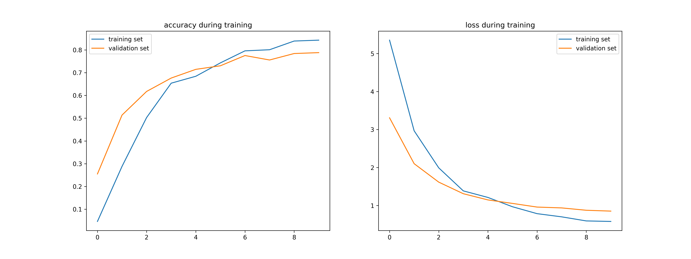
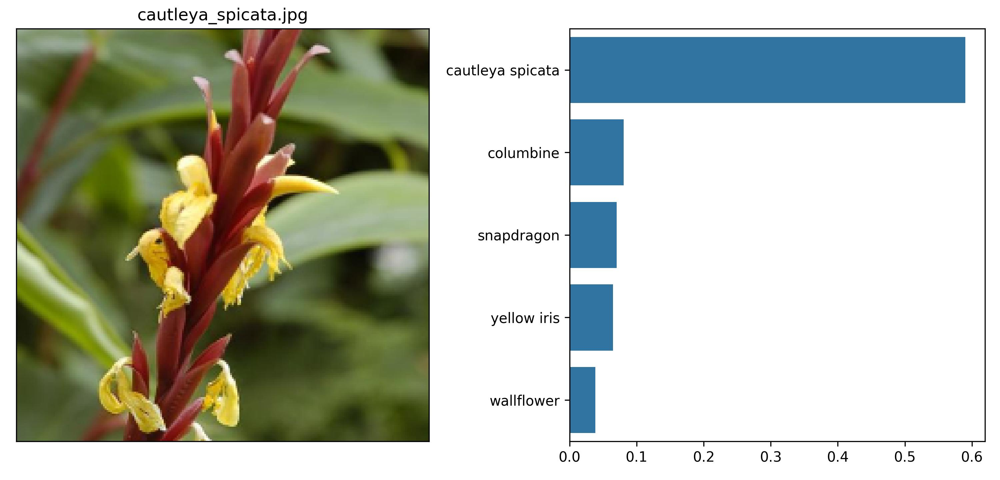
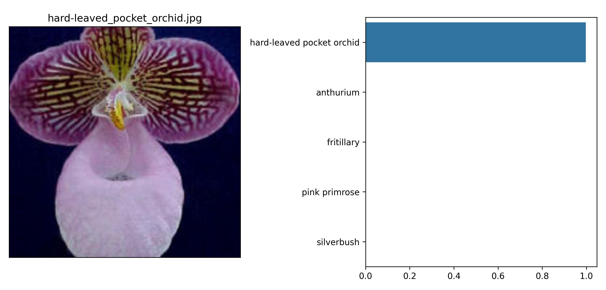
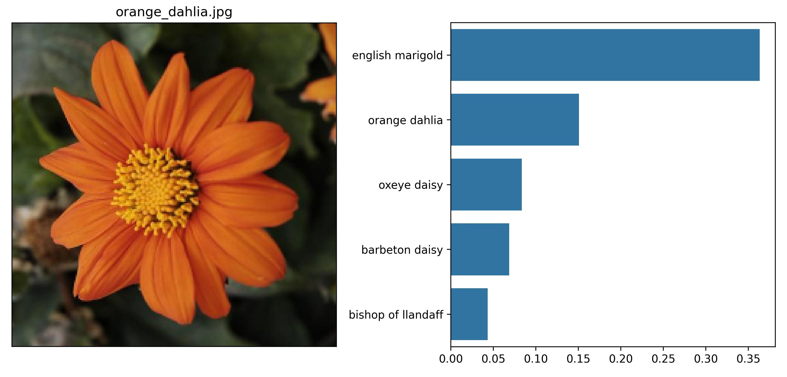
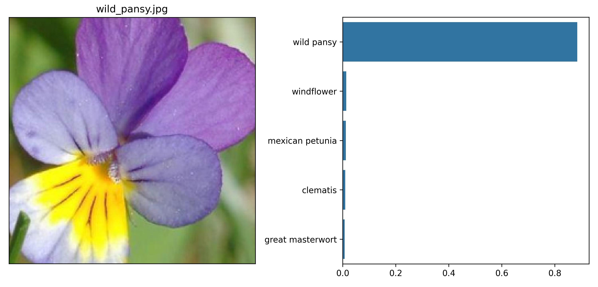

# Introduction
This is my submission for the *Image Classifier* project as part of the Udacity nanodegree [Introduction to Machine Learning with TensorFlow](https://learn.udacity.com/nanodegrees/nd230). The point of this project is to demonstrate understanding of deep learning concepts and the `tensorflow` library through a toy classification task. The task is to classify images of flowers into one of 102 possible categories. This is accomplished using transfer learning starting with the [MobileNetV3](https://arxiv.org/pdf/1905.02244) neural network. I freeze the pretrained model layers and replace the last classification layer with a new neural network, which is then trained for the flowers classification task.

# Setup
The easiest way to run this project is via Docker container.  I have included a Dockerfile and instructions for running both with and without GPU support.  Note that the CUDA libraries required for GPU support make the container significantly larger, but it should run significantly faster.

```console
$ docker image ls
REPOSITORY                            TAG                  IMAGE ID       CREATED          SIZE
udacity-tensorflow-notebook-cpu       latest               2d85bdae5e39   13 minutes ago   2.86GB
udacity-tensorflow-notebook-gpu       latest               9f532a6348cd   12 hours ago     8.08GB
```

These are the versions of the relevant libraries that are installed via `Dockerfile` and `pip`.

```
jupyterlab==4.0.9
matplotlib==3.8.2
numpy==1.26.2
pandas==2.2.2
Pillow==10.1.0
protobuf==3.20.3
seaborn==0.13.2
tensorflow==2.15.0.post1
tensorflow-datasets==4.8.0
tensorflow-hub==0.15.0
tensorflow-metadata==1.12.0
```

## Docker container with GPU support
```bash
# clone git repo
git clone git@github.com:mrperkett/udacity-project-create-image-classifier-oxford-flowers-102.git
cd udacity-project-create-image-classifier-oxford-flowers-102/

# build tensorflow and jupyter docker image
docker build --no-cache -t udacity-tensorflow-notebook-gpu -f Dockerfile .

# run the docker container starting a jupyter lab server
# - mount the current working directory to /work/ in the image
# - mount the default local tensorflow_datasets directory to the default tensorflow_datasets directory.  This is to
#   allow tensorflow to locate already downloaded datasets outside of the Docker image, so they do not need to be
#   downloaded every time you start a new image.
local_work_dir="."
local_datasets_dir=`echo ~`/tensorflow_datasets/
port=8888

docker run -e port=${port} --gpus all -p ${port}:${port} -it --rm -v "${local_work_dir}":/work -v "${local_datasets_dir}":/root/tensorflow_datasets udacity-tensorflow-notebook-gpu
# Connect via your browser or other means (e.g. use VSCode Dev Containers to attach to a running container)
```

To run a command, replace the end of the function call with the command you with to run.

```bash
# Example: open a bash shell
docker run --gpus all -p ${port}:${port} -it --rm -v "${local_work_dir}":/work -v "${local_datasets_dir}":/root/tensorflow_datasets udacity-tensorflow-notebook-gpu bash

# Example: run predict.py
docker run --gpus all -it --rm -v "${local_work_dir}":/work -v "${local_datasets_dir}":/root/tensorflow_datasets udacity-tensorflow-notebook-gpu python3 /work/predict.py /work/test_images/cautleya_spicata.jpg /work/output/saved_model.keras --top_k 5 --category_names /work/label_map.json
```

## Docker container with no GPU support
```bash
# clone git repo
git clone git@github.com:mrperkett/udacity-project-create-image-classifier-oxford-flowers-102.git
cd udacity-project-create-image-classifier-oxford-flowers-102/

# build tensorflow and jupyter docker image
docker build --no-cache -t udacity-tensorflow-notebook-cpu -f Dockerfile-cpu .

# run the docker container starting a jupyter lab server
# - mount the current working directory to /work/ in the image
# - mount the default local tensorflow_datasets directory to the default tensorflow_datasets directory.  This is to
#   allow tensorflow to locate already downloaded datasets outside of the Docker image, so they do not need to be
#   downloaded every time you start a new image.
local_work_dir="."
local_datasets_dir=`echo ~`/tensorflow_datasets/
port=8888

docker run -e port=${port} -p ${port}:${port} -it --rm -v "${local_work_dir}":/work -v "${local_datasets_dir}":/root/tensorflow_datasets udacity-tensorflow-notebook-cpu
# Connect via your browser or other means (e.g. use VSCode Dev Containers to attach to a running container)
```

To run a command, replace the end of the function call with the command you with to run.

```bash
# Example: open a bash shell
docker run -p ${port}:${port} -it --rm -v "${local_work_dir}":/work -v "${local_datasets_dir}":/root/tensorflow_datasets udacity-tensorflow-notebook-cpu bash

# Example: run predict.py
docker run -it --rm -v "${local_work_dir}":/work -v "${local_datasets_dir}":/root/tensorflow_datasets udacity-tensorflow-notebook-cpu python3 /work/predict.py /work/test_images/cautleya_spicata.jpg /work/output/saved_model.keras --top_k 5 --category_names /work/label_map.json
```

# Running `Project_Image_Classifier_Project.ipynb`
Connect to the Jupyter server as described in the Setup section and run [Project_Image_Classifier_Project.ipynb](Project_Image_Classifier_Project.ipynb) as normal (html: [Project_Image_Classifier_Project.html](Project_Image_Classifier_Project.html)).

# Running `predict.py`
You can run these directly from the bash shell or a docker command as described in the Setup section.

## Call signature
```console
$ python3 ./predict.py -h
usage: predict.py [-h] [--top_k TOP_K] [--category_names CATEGORY_NAMES] image_file_path model_file_path

positional arguments:
  image_file_path       File path for the jpeg image to classify
  model_file_path       File path for the saved model

options:
  -h, --help            show this help message and exit
  --top_k TOP_K         Display the top <top_k> predicted classes
  --category_names CATEGORY_NAMES
                        JSON input file specifying the category label to class label (e.g. '0': 'pink primrose')
```

## Examples
```console
$ python3 ./predict.py test_images/cautleya_spicata.jpg saved_model.keras --top_k 5 --category_names label_map.json
class_idx     prob       class_name
60            0.5900     cautleya spicata
83            0.0808     columbine
10            0.0701     snapdragon
14            0.0647     yellow iris
45            0.0384     wallflower

$ python3 ./predict.py test_images/cautleya_spicata.jpg saved_model.keras --category_names label_map.json
class_idx     prob       class_name
60            0.5900     cautleya spicata

$ python3 ./predict.py test_images/cautleya_spicata.jpg saved_model.keras --top_k 5
class_idx     prob       class_name
60            0.5900     
83            0.0808     
10            0.0701     
14            0.0647     
45            0.038

$ python3 ./predict.py test_images/cautleya_spicata.jpg saved_model.keras
class_idx     prob       class_name
60            0.5900
```

## Example using `docker run`
Note that all the file paths are relative to the container mounted volume.  Adjust `local_work_dir` and `local_datasets_dir` as necessary.

```console
$ local_work_dir="."
$ local_datasets_dir=`echo ~`/tensorflow_datasets/
$ docker run --gpus all -it --rm -v "${local_work_dir}":/work -v "${local_datasets_dir}":/root/tensorflow_datasets udacity-tensorflow-notebook-gpu python3 /work/predict.py /work/test_images/cautleya_spicata.jpg /work/output/saved_model.keras --top_k 5 --category_names /work/label_map.json
class_idx     prob       class_name
60            0.5900     cautleya spicata
83            0.0808     columbine
10            0.0701     snapdragon
14            0.0647     yellow iris
45            0.0384     wallflower
```

# Results
See [Project_Image_Classifier_Project.ipynb](Project_Image_Classifier_Project.ipynb) (html: [Project_Image_Classifier_Project.html](Project_Image_Classifier_Project.html)) for the full results.

Training over 10 epochs resulted in 74.8% accuracy on the withheld *testing* data with a loss of 1.01.



Below are some images and their predictions.  To generate additional plots like these, you can use `utils.plot_predictions()`.  This functionality is not currently part of the `predict.py` script.





